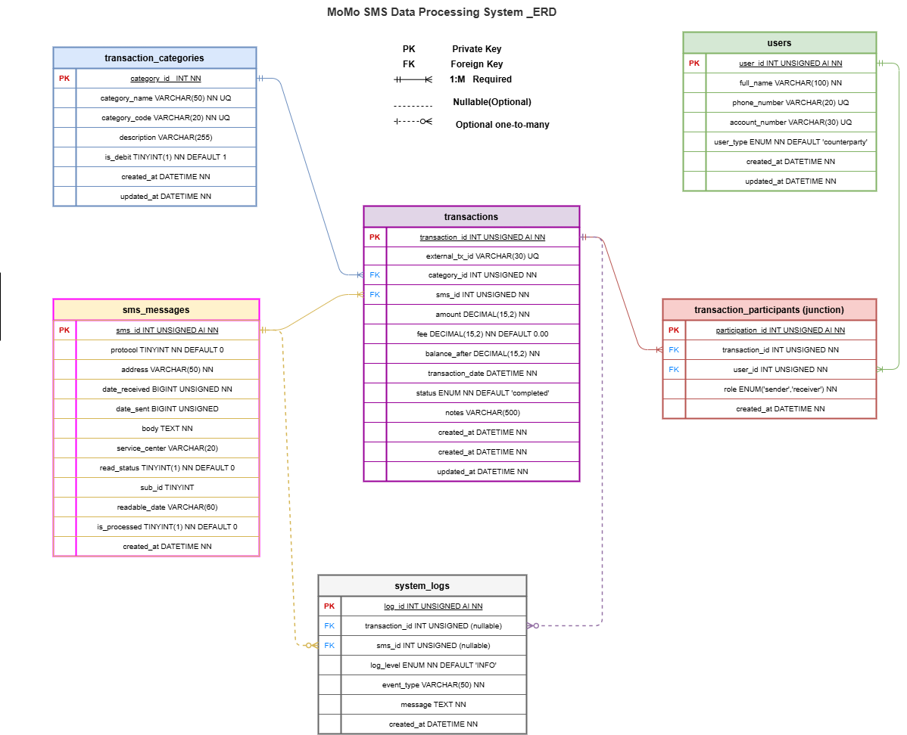

# Team8C3 — MoMo ETL Dashboard

A fullstack data engineering project that processes MTN Mobile Money (MoMo) SMS data exported in XML format. The pipeline cleans, categorizes, and stores transaction records in a relational database, then exposes the data through a static frontend dashboard for analysis and visualization.

> 🔗 **Repository:** [https://github.com/Success85/Team10_momo-etl-dashboard](https://github.com/Success85/Team10_momo-etl-dashboard)

---

## Team

**Team Name:** Team8C3

| Name | Role |
|---|---|
| Success Ituma | SQL Database Implementation + Documentation|
| Panom Michael Makuei | ERD Diagram + CRUD + Srumb Board |
| Nathnael Eticha Ayele | JSON Modeling + Documentation |

---

## Project Description

MTN MoMo generates SMS notifications for every transaction which includes: incoming payments, transfers, airtime purchases, bank deposits, and more. This project builds an end-to-end pipeline to:

1. **Parse** raw MoMo SMS data from an XML export file
2. **Clean and normalize** amounts, dates, and phone numbers
3. **Categorize** transactions by type using rule-based logic
4. **Load** structured records into a MySQL relational database
5. **Export** aggregated JSON for frontend consumption
6. **Visualize** transaction history, trends, and summaries on a dashboard

---

## Repository Structure

```
Team10_momo-etl-dashboard/
├── README.md
├── .env.example
├── requirements.txt
├── index.html
├── web/
│   ├── styles.css
│   ├── chart_handler.js
│   └── assets/
├── data/
│   ├── raw/
│   │   └── momo.xml
│   ├── processed/
│   │   └── dashboard.json
│   ├── db.sqlite3
│   └── logs/
│       ├── etl.log
│       └── dead_letter/
├── etl/
│   ├── __init__.py
│   ├── config.py
│   ├── parse_xml.py
│   ├── clean_normalize.py
│   ├── categorize.py
│   ├── load_db.py
│   └── run.py
├── api/
│   ├── __init__.py
│   ├── app.py
│   ├── db.py
│   └── schemas.py
├── scripts/
│   ├── run_etl.sh
│   ├── export_json.sh
│   └── serve_frontend.sh
├── tests/
│   ├── test_parse_xml.py
│   ├── test_clean_normalize.py
│   └── test_categorize.py
├── database/
│   └── database_setup.sql
├── docs/
│   ├── architecture.jpg
│   ├── ERD_diagram.png               
│   └── database_design_document.pdf  
└── examples/
    └── json_schemas.json             
```

---

## Database Design

The database was designed in to store and organize the MoMo SMS transaction data from the XML backup file. The schema is implemented in MySQL and consists of 6 tables derived directly from analyzing the real SMS data.

### Tables Overview

| Table | Rows | Description |
|---|---|---|
| `transaction_categories` | 7 | Lookup table for the 7 MoMo transaction types |
| `users` | 7 | Account holder and all counterparties — merchants, banks, recipients |
| `sms_messages` | 10+ | Raw SMS records preserved exactly from the XML backup |
| `transactions` | 10+ | Parsed financial records — the primary analytical table |
| `transaction_participants` | — | Junction table resolving the M:N relationship between transactions and users |
| `system_logs` | — | Audit trail for all import, parse, and processing events |

### Key Design Decisions

- **sms_messages** preserves all raw XML attributes as columns, keeping the original data intact as a source of truth
- **transaction_participants** is a junction table that resolves the many-to-many relationship between users and transactions — a user can be sender in one transaction and receiver in another
- **system_logs** uses nullable FKs with `ON DELETE SET NULL` so audit history is never lost even if source records are deleted
- **transactions** links back to its source SMS via `sms_id` (nullable, `ON DELETE SET NULL`) so financial records survive SMS cleanup
- All money columns use `DECIMAL(15,2)` and are protected by CHECK constraints preventing negative amounts or balances

### ERD



> Full documentation available in `docs/database_design_document.pdf`

### Views

Three views are included for reporting and API use:

- **vw_transaction_details** — joins all tables into one flat result with sender, receiver, category, and computed totals
- **vw_spending_by_category** — aggregated spending summary grouped by transaction type
- **vw_user_transaction_history** — full transaction history per user with roles

---

## System Architecture


> 🔗 [View full diagram using the link](https://drive.google.com/file/d/1osJvG8CJ-X3vtCAiOSXfQrCpunGgx8CZ/view?usp=sharing)

---

## Scrum Board

> 🔗 [View our GitHub Projects Scrum Board](https://github.com/users/Success85/projects/2/views/1)

---

## Getting Started

### Prerequisites

- MySQL Server 8.0+
- MySQL Workbench or any MySQL client
- Python 3.9+
- pip

### Database Setup

```bash
# Clone the repository
git clone https://github.com/Success85/Team10_momo-etl-dashboard.git
cd Team10_momo-etl-dashboard

# Run the SQL script in MySQL Workbench
# File → Open SQL Script → database/database_setup.sql → Run

# Or from terminal
mysql -u root -p < database/database_setup.sql
```

### ETL Pipeline

```bash
pip install -r requirements.txt
cp .env.example .env

# Place your momo.xml file in data/raw/
bash scripts/run_etl.sh
```

### Dashboard

```bash
bash scripts/serve_frontend.sh
# Open http://localhost:8000
```

---

## Tech Stack

| Layer | Technology |
|---|---|
| Database | MySQL 8.0 |
| Data parsing | Python (ElementTree / lxml) |
| Data cleaning | Python (dateutil, re) |
| Backend API | FastAPI + Pydantic |
| Frontend | HTML, CSS, JavaScript |
| Visualization | Chart.js |
| Version control | Git + GitHub |
| Project management | GitHub Projects |

---

## Data Notes

- Raw XML files in `data/raw/` are **git-ignored** to protect sensitive transaction data
- Processed outputs in `data/processed/` contain only aggregated, anonymized summaries
- Unparseable records are saved to `data/logs/dead_letter/` for review
- All financial amounts are stored in Rwandan Franc (RWF)