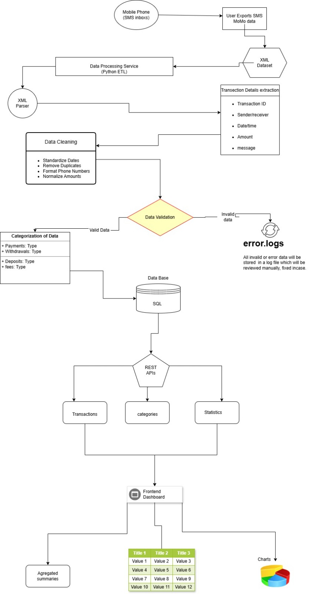

# Team10 — MoMo ETL Dashboard

A fullstack data engineering project that processes MTN Mobile Money (MoMo) SMS data exported in XML format. The pipeline cleans, categorizes, and stores transaction records in a relational database, then exposes the data through a static frontend dashboard for analysis and visualization.

> 🔗 **Repository:** [https://github.com/Success85/Team10_momo-etl-dashboard](https://github.com/Success85/Team10_momo-etl-dashboard)

---

## Team

| Name | Role |
|------|------|
| Success | Database |
| Nathael | Backend / ETL |
| Michael | Frontend |

---

## Project Description

MTN MoMo generates SMS notifications for every transaction — incoming payments, transfers, airtime purchases, bank deposits, and more. This project builds an end-to-end pipeline to:

1. **Parse** raw MoMo SMS data from an XML export file
2. **Clean and normalize** amounts, dates, and phone numbers
3. **Categorize** transactions by type using rule-based logic
4. **Load** structured records into a SQLite relational database
5. **Export** aggregated JSON for frontend consumption
6. **Visualize** transaction history, trends, and summaries on a dashboard

---

## Repository Structure

```
momo-data-pipeline/
├── README.md                         # Setup, run instructions, overview
├── .env.example                      # Environment variable template
├── requirements.txt                  # Python dependencies
├── index.html                        # Dashboard entry point (static)
├── web/
│   ├── styles.css                    # Dashboard styling
│   ├── chart_handler.js              # Fetch + render charts and tables
│   └── assets/                       # Images and icons
├── data/
│   ├── raw/                          # Raw XML input (git-ignored)
│   │   └── momo.xml
│   ├── processed/                    # Cleaned outputs for frontend
│   │   └── dashboard.json
│   ├── db.sqlite3                    # SQLite database file
│   └── logs/
│       ├── etl.log                   # Structured ETL run logs
│       └── dead_letter/              # Unparsed or ignored XML snippets
├── etl/
│   ├── __init__.py
│   ├── config.py                     # File paths, thresholds, categories
│   ├── parse_xml.py                  # XML parsing with ElementTree/lxml
│   ├── clean_normalize.py            # Amounts, dates, phone normalization
│   ├── categorize.py                 # Rule-based transaction categorization
│   ├── load_db.py                    # Table creation and upsert to SQLite
│   └── run.py                        # CLI: parse → clean → categorize → load → export
├── api/                              # Optional bonus
│   ├── __init__.py
│   ├── app.py                        # FastAPI app with /transactions, /analytics
│   ├── db.py                         # SQLite connection helpers
│   └── schemas.py                    # Pydantic response models
├── scripts/
│   ├── run_etl.sh                    # Runs the full ETL pipeline
│   ├── export_json.sh                # Rebuilds dashboard.json from DB
│   └── serve_frontend.sh             # Serves the static frontend locally
└── tests/
    ├── test_parse_xml.py
    ├── test_clean_normalize.py
    └── test_categorize.py
```

---

## System Architecture
Found in docs/


> 🔗 [View full diagram on Draw.io](https://drive.google.com/file/d/1osJvG8CJ-X3vtCAiOSXfQrCpunGgx8CZ/view?usp=sharing)

---

## Scrum Board

> 🔗 [View our GitHub Projects Scrum Board](https://github.com/users/Success85/projects/2/views/1)

---

## Getting Started

### Prerequisites

- Python 3.9+
- pip

### Installation

```bash
# Clone the repository
git clone https://github.com/Success85/Team10_momo-etl-dashboard.git
cd Team10_momo-etl-dashboard

# Install dependencies
pip install -r requirements.txt

# Copy environment variables
cp .env.example .env
```

### Running the ETL Pipeline

```bash
# Place your momo.xml file in data/raw/
bash scripts/run_etl.sh
```

### Serving the Dashboard

```bash
bash scripts/serve_frontend.sh
# Then open http://localhost:8000 in your browser
```

---

## Data Notes

- Raw XML files in `data/raw/` are **git-ignored** to protect sensitive transaction data
- Processed outputs in `data/processed/` contain only aggregated, anonymized summaries
- Unparseable records are saved to `data/logs/dead_letter/` for review

---

## Tech Stack

| Layer | Technology |
|-------|-----------|
| Data parsing | Python (ElementTree / lxml) |
| Data cleaning | Python (dateutil, re) |
| Database | SQLite |
| Backend API (optional) | FastAPI + Pydantic |
| Frontend | HTML, CSS, JavaScript |
| Visualization | Chart.js |
| Version control | Git + GitHub |
| Project management | GitHub Projects |
