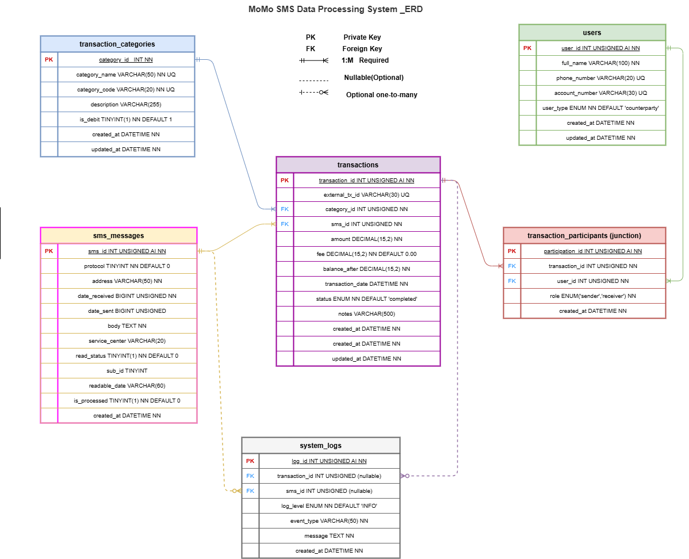
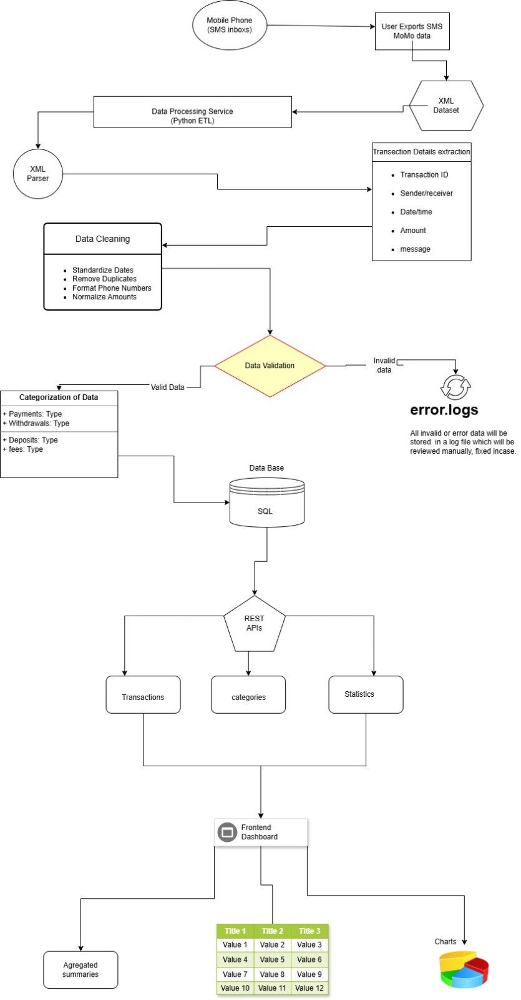

# Team8C3 — MoMo SMS Data Processing System

A fullstack data engineering project that processes MTN Mobile Money (MoMo) SMS data exported in XML format. The pipeline parses, categorizes, and stores transaction records in a relational database, then exposes the data through a secured REST API.

> 🔗 **Repository:** [https://github.com/Success85/Team8C3_momo-etl-dashboard](https://github.com/Success85/Team8C3_momo-etl-dashboard)

---

## Documentation

| Document | Link |
|---|---|
| Database Design Document | [docs/database_design_document.pdf](docs/database_design_document.pdf) |
| ERD Diagram | [docs/erd_diagram.png](docs/erd_diagram.png) |
| API Documentation | [docs/api_docs.md](docs/api_docs.md) |
| API Report (Week 3) | [docs/API_Report_Team8C3.pdf](docs/API_Report_Team8C3.pdf) |
| SQL to JSON Mapping | [docs/sql_to_json_mapping_doc.md](docs/sql_to_json_mapping_doc.md) |
| System Architecture | [docs/architecture.jpg](docs/architecture.jpg) |
| AI Usage Log (Week 2) | [docs/AI_usage_log/AI_usage_log_[EWD_Database Design and Implementation_Cohort 3_Team8].pdf](docs/AI_usage_log/AI_usage_log_[EWD_Database%20Design%20and%20Implementation_Cohort%203_Team8].pdf) |
| AI Usage Log (Week 3) | [docs/AI_usage_log/Team8Cohort3_AI Usage Log.pdf](docs/AI_usage_log/Team8Cohort3_AI%20Usage%20Log.pdf) |
| Team Participation Sheet (Week 2) | [docs/team Participation Sheet/BSE Team Task Sheet_[EWD_Database Design and Implementation_Cohort 3_Team8].pdf](docs/team%20Participation%20Sheet/BSE%20Team%20Task%20Sheet_%5BEWD_Database%20Design%20and%20Implementation_Cohort%203_Team8%5D%20-%201.pdf) |
| Team Participation Sheet (Week 3) | [docs/team Participation Sheet/BSE Team Task Sheet_[EWD_Building_and_Securing_a_REST_API_Cohort 3_Team8].pdf](docs/team%20Participation%20Sheet/BSE%20Team%20Task%20Sheet_%5BEWD_Building_and_Securing_a_REST%20_API_Cohort%203_Team8%5D%20.pdf) |

---

## Team

**Team Name:** Team8C3

| Name | Role |
|---|---|
| Success Ituma | Database Implementation (SQLite + MySQL) + POST Endpoint + DSA |
| Panom Michael Makuei | ERD Diagram + GET/PUT/DELETE Endpoints + Authentication + Scrum Board |
| Nathnael Eticha Ayele | XML Parsing + ETL Pipeline + JSON Modeling + Repo Structure |

---

## Project Description

MTN MoMo generates an SMS notification for every transaction — incoming payments, transfers, airtime purchases, bank deposits, and more. This project builds an end-to-end pipeline to:

1. **Parse** raw MoMo SMS data from an XML backup file (1,693 records)
2. **Clean and normalize** amounts, dates, and transaction types
3. **Categorize** transactions using rule-based pattern matching
4. **Load** structured records into a SQLite relational database
5. **Expose** transaction data through a secured REST API
6. **Visualize** transaction history and summaries on a frontend dashboard

---

## Repository Structure

```
Team8C3_momo-etl-dashboard/
├── README.md
├── .env.example
├── requirements.txt
├── index.html
├── web/
│   ├── styles.css
│   ├── chart_handler.js
│   └── assets/
├── data/
│   ├── raw/
│   │   ├── modified_sms_v2.xml
│   │   └── momo.xml
│   ├── processed/
│   │   └── dashboard.json
│   ├── momo.db
│   └── logs/
│       ├── etl.log
│       └── dead_letter/
├── etl/
│   ├── __init__.py
│   ├── config.py
│   ├── parse_xml.py
│   ├── clean_normalize.py
│   ├── categorize.py
│   ├── load_db.py
│   └── run.py
├── api/
│   ├── __init__.py
│   ├── app.py
│   ├── db.py
│   └── schemas.py
├── dsa/
│   ├── __init__.py
│   └── search.py
├── scripts/
│   ├── run_etl.sh
│   ├── export_json.sh
│   └── serve_frontend.sh
├── tests/
│   ├── test_parse_xml.py
│   ├── test_clean_normalize.py
│   └── test_categorize.py
├── database/
│   └── database_setup.sql
├── docs/
│   ├── AI_usage_log/
│   │   ├── AI_usage_log_[EWD_Database Design and Implementation_Cohort 3_Team8].pdf
│   │   └── Team8Cohort3_AI Usage Log.pdf
│   ├── team Participation Sheet/
│   │   ├── BSE Team Task Sheet_[EWD_Building_and_Securing_a_REST_API_Cohort 3_Team8].pdf
│   │   └── BSE Team Task Sheet_[EWD_Database Design and Implementation_Cohort 3_Team8].pdf
│   ├── architecture.jpg
│   ├── erd_diagram.png
│   ├── api_docs.md
│   ├── API_Report_Team8C3.pdf
│   ├── sql_to_json_mapping_doc.md
│   └── database_design_document.pdf
├── screenshots/
│   ├── 01_get_unauthorized.png
│   ├── 02_get_wrong_credentials.png
│   ├── 03_get_all_transactions.png
│   ├── 04_get_one_transaction.png
│   ├── 05_post_transaction.png
│   ├── 06_put_transaction.png
│   ├── 07_delete_transaction.png
│   └── 08_dsa_comparison.png
└── examples/
    └── json_schemas.json
```

---

## Database Design (Week 2)

The database schema is implemented in MySQL and documented in `docs/database_design_document.pdf`. It consists of 6 tables derived from analyzing real MoMo SMS data.

| Table | Description |
|---|---|
| `transaction_categories` | Lookup table for 7 MoMo transaction types |
| `users` | Account holder and all counterparties |
| `sms_messages` | Raw SMS records from the XML backup |
| `transactions` | Parsed financial records |
| `transaction_participants` | Junction table resolving M:N between transactions and users |
| `system_logs` | Audit trail for all processing events |

> Full schema: `database/database_setup.sql`
> Full documentation: [docs/database_design_document.pdf](docs/database_design_document.pdf)
> ERD Diagram: [docs/erd_diagram.png](docs/erd_diagram.png)

### ERD



---

## REST API (Week 3)

A secured REST API built with Python's `http.server` that exposes the MoMo transaction data. All endpoints require Basic Authentication.

### Endpoints

| Method | Endpoint | Description |
|---|---|---|
| GET | `/transactions` | List all transactions |
| GET | `/transactions/{id}` | Get one transaction by ID |
| POST | `/transactions` | Add a new transaction |
| PUT | `/transactions/{id}` | Update an existing transaction |
| DELETE | `/transactions/{id}` | Delete a transaction |

> Full API documentation: [docs/api_docs.md](docs/api_docs.md)
> Week 3 Report: [docs/API_Report_Team8C3.pdf](docs/API_Report_Team8C3.pdf)

### Authentication

All endpoints are protected with Basic Authentication.

```
Username: admin
Password: MOMO123
```

Requests without valid credentials return `401 Unauthorized`.

---

## DSA — Search Efficiency (Week 3)

`dsa/search.py` implements and compares two search algorithms against the full transaction dataset:

| Algorithm | Time Complexity | Average Time (4,177 records) |
|---|---|---|
| Linear Search | O(n) | 1.5528 ms |
| Dictionary Lookup | O(1) | 0.0051 ms |

Dictionary lookup is **307x faster** than linear search on this dataset.

---

## Getting Started

### Prerequisites

- Python 3.9+
- pip
- MySQL Server 8.0+ (for Week 2 database)
- MySQL Workbench (optional)

### Installation

```bash
git clone https://github.com/Success85/Team8C3_momo-etl-dashboard.git
cd Team8C3_momo-etl-dashboard
pip install -r requirements.txt
cp .env.example .env
```

### Run the ETL Pipeline

Parses the XML file and loads transactions into the SQLite database:

```bash
python3 etl/run.py
```

### Start the API Server

```bash
python3 api/app.py
```

Server runs at `http://localhost:8000`.

### Test the API

```bash
# Get all transactions
curl -u admin:MOMO123 http://localhost:8000/transactions

# Get one transaction
curl -u admin:MOMO123 http://localhost:8000/transactions/1

# Add a new transaction
curl -u admin:MOMO123 -X POST -H "Content-Type: application/json" \
  -d '{"transaction_type": "MERCHANT_PAY", "amount": 3000, "sender": "Account Owner"}' \
  http://localhost:8000/transactions
```

### Run the MySQL Schema (Week 2)

```bash
mysql -u root -p < database/database_setup.sql
```

### Run the DSA Comparison

```bash
python3 dsa/search.py
```

### Serve the Dashboard

```bash
bash scripts/serve_frontend.sh
# Open http://localhost:8000
```

---

## Tech Stack

| Layer | Technology |
|---|---|
| Database (Week 2) | MySQL 8.0 |
| Database (Week 3) | SQLite via Python |
| ETL Pipeline | Python (ElementTree, re, dateutil) |
| REST API | Python http.server |
| Data Validation | Python (schemas.py) |
| DSA | Python (linear search, dictionary lookup) |
| Frontend | HTML, CSS, JavaScript |
| Visualization | Chart.js |
| Version control | Git + GitHub |
| Project management | GitHub Projects |

---

## Scrum Board

> 🔗 [View our GitHub Projects Scrum Board](https://github.com/users/Success85/projects/2/views/1)

---

## System Architecture



> 🔗 [View full diagram](https://drive.google.com/file/d/1osJvG8CJ-X3vtCAiOSXfQrCpunGgx8CZ/view?usp=sharing)

---

## Data Notes

- Raw XML files in `data/raw/` are **git-ignored** to protect sensitive transaction data
- Processed outputs in `data/processed/` contain only aggregated, anonymized summaries
- Unparseable SMS records are saved to `data/logs/dead_letter/` for review
- All financial amounts are stored in Rwandan Franc (RWF)
- The SQLite database file `data/momo.db` is also git-ignored
